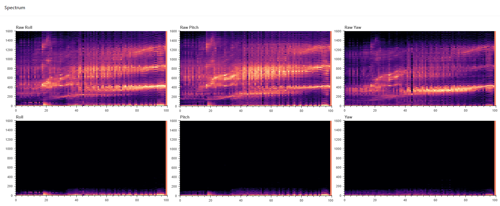
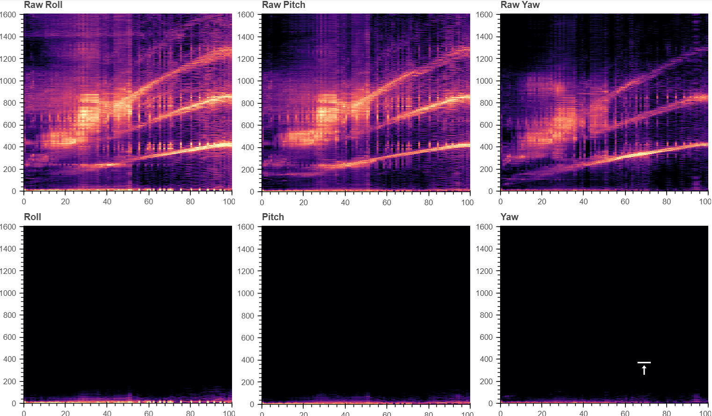

# Noise Analysis

The PID controller relies on gyro data. So if the real motion signal of the drone is submerged in noise, the PID controller might perform poorly which makes unstable control and even cause the drone to lose control completely and crash.

You would better do a throttle sweep sampling flight according to our [Sampling flight wiki](../quick-guide/sampling-flight.md) before the analysis.

In addition, I wanna say that noise analysis is not offered as a universal technique capable of solving all problems, but rather as an adjunct to the classical methods already well known and tried. We assume that the readers of this wiki are pilots who have certain flight experience but only know little about noise analysis.

### The composition of noise

The noise on our drones often consists of several different parts, like:

* electronic sensor noise (including voltage spikes from ESCs, gyro sensor's random noise, radio frequency interference from video signal lines for example, etc),
* resonances in frame/props/other setups,
* motor vibrations

In BBM, we offer the PSD (Power Spectral Density) plots to analyze the power of the noise of a drone.

Noted that our PSD plots are just like noise plots in Plasmatree-analyzer which are non-cumulative, which means the result of the plots is not related to the flight time length.

* From left to right are resuts on Roll, Pitch and Yaw axis.
* The X-axis is throttle from 0-100%.
* The Y-axis is the frequency in Hz, ranging from 0Hz to Nyquist frequency (depends on your sampling frequency). For more details about Nyquist frequency, you can check our wiki here: [Nyquist frequency](../in-depth-talk/nyquist-frequency.md)
* The Z-axis is the power value (normalize by sampling frequency, see FFT, Power Spectrum and PSD for more details), rendered with a colormap called by `magma`.
* The colour-grading is on a logarithmic scale to improve details (`10 x log10(PSD)`,default is -40 \~ +10dbm)
* If you set your blackbox debug mode to `GYRO_SCALED`then BBM will calculate and plot raw gyro data PSD result on the first row which is the prefiltered gyro signal, this is quite useful if you wanna analyze your noise from the scratch

### Example

Let's grab a log file from a G47x FC with BMI270 gyro sensor, debug mode was set to `GYRO_SCALED`.

* Horizontal bright spots basically indicate the presence of resonance/electrical noise. 1) The transverse light spot at 230hz is most likely to be the resonance frequency of the props; 2) The lateral faint light spot at 1400hz may be noise from the power supply.
* There are three possibilities for vertical bright spots: 1) Strong wind; 2) Hitting tree branches/ground; 3) Too little data leading to accidental results.
* The bright spots diagonally to the upper right are the motor noise and its harmonics. So from throttle 0-100%: 1) 0 - 430Hz is the motor noise; 2) 0 - 860Hz is the first harmonic; 3) 0 - 1290Hz is the second harmonic; 4) you can even see the third harmonic on roll and pitch axis, but it bounced back to sub 1600hz frequency band once it hit the Nyquist Frequency with throttle goes up.
* The dark purple part scattered in the rest of the spectrogram is the random noise of the gyroscope itself.

### Tuning tips

* For motor noise and its harmonics, RPM filters in betaflight is a really powerful solution for "deleting" them.
* For those resonances, you can use a static notch filter to handle that, or you can just use the dynamic notch filter.
* If you can still see some dark purple spots in the range above 100hz in the result of the RPY (filtered) results, try to lower the LPFs' cutoff.
* If you basically can’t find the dark purple spot in the range above 100hz in the result of the "Roll", "Pitch" and "Yaw" (filtered) results below the Raw data row, that means your gyro filtering is strong enough. The next tuning step for you is probably to slowly increase filter cutoffs to improve delay, or you can just leave it there and go out and enjoy the flight.

### Q\&A

**Q:** Why don't you offer results for D-term? How to tune D-term filtering?\
**A:** Just analyzing the spectrum of D-term is really meaningless. D-term is part of the PID controller and due to the D-term in PID controller should act as a high-band bypass filterm it just should consist some "noise" in order to improve system's performance.

**Q:** I see a weird spot in 0-300Hz with throttle 60-80%.\
**A:** That might be an aliasing frequency, for more info please check [Nyquist Frequency](../in-depth-talk/nyquist-frequency.md).

**Q:** I tried to increase the Q of RPM filters and dynamic notch filters, but there still are some horizontal and diagonal spots.\
**A:** In many cases, a solid frame with 4 nice motors often result in less noise. If you have a lot of noise, then I guess you should probably upgrade your drones.

