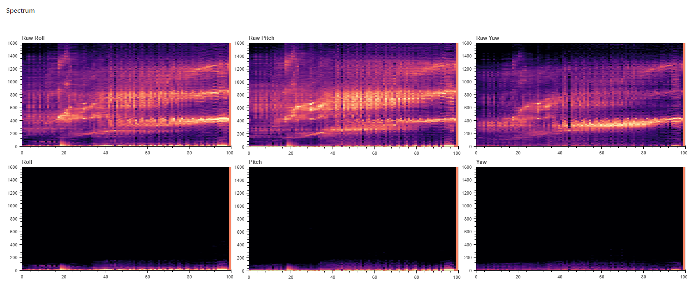

# FFT, Power Spectrum and PSD

_Why use the PSD spectrogram instead of the FFT spectrogram?_ I guess this is a question that many users will have.

In this Wiki, we will show you why we think PSD should be used as the GOLDEN standard for spectrum analysis.

We assume that the readers of this wiki are pilots who have certain flight experience and want to understand filtering and common evaluating standards.

### What's wrong with the FFT spectrum?

In control theory, we only care about the amplitude and phase of the signal. There's nothing wrong with it since the control theory only cares about those two components.

While it's convenient and straightforward, the FFT amplitude is seldom used in the statistics of signals. This is because it doesn't fit well with the physics of how signals operate. In most cases, the important parameter is not the amplitude, but the power. For example, when random noise signals combine in an electronic circuit, the resultant noise is equal to the combined power of the individual signals, not their combined amplitude.

On the other hand, due to the statistically uniform distribution of the phase of random noise, as with more samples being collected, the amplitude of random noise will be lower and lower.

Let's take a look at a real-world signal piece (3215hz on BMI270 maximum FIFO mode, throttle stays on 99%):

And the FFT result:

The amplitute on non-characteristic frequencies on "1 sec" is lower than "0.5 sec". It matches up the theory, right?

### OK, so let's turn to the power spectrum (auto-power)?

Alas, that's another bad option.

The power spectrum can show us the power of the signal at various frequency components, but it is susceptible to frequency resolution.

Frequency precision = Sampling frequency / Number of time points

So for example, if we intercept 512 points of data and 1024 points of data from the 3.2Khz sampling rate data of BMI270 sensor, the frequency precision is (3205/512)Hz and (3205/1024)Hz.

Here's a picture that shows how the frequency resolution changes the result of auto-power:

And in real-world signal:

### Power Spectral Density

PSD normalizes the result under different frequency resolutions, eliminates the influence of resolution.

This makes the spectrum data comparable between different sampling rates, even between different gyroscopes, e.g. BMI270@3K2 VS MPU6000@8k

In addition, since it provides a normalized absolute term, we can now easily define "how low is the noise": in our research, we found that -40dBm is a common value for "low noise threshold". As the lower bound in BBM PSD spectrogram is -40dBm by default, when you can't see any light spot in spectrogram, that means your noise level is low enough.

#### Reference

[http://www.dspguide.com/ch2/2.htm](http://www.dspguide.com/ch2/2.htm)
