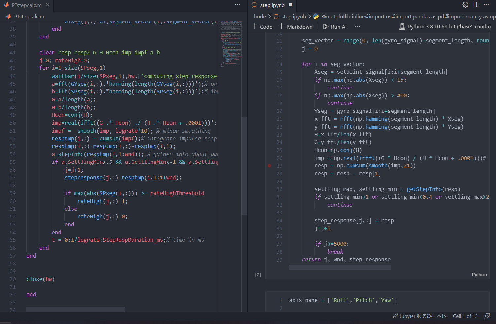

# Why did we choose AGPL3.0

**For you reference:**

* betaflight uses GPL-3.0
* INAV uses GPL-3.0
* PIDtoolbox uses GPL-3.0
* OpenTX/EgdeTX uses GPL-2.0

But BBM kernel chooses AGPL-3.0 as our open source license. Why?

In this wiki, we hope that by using plain and easy-to-understand language and logic we can thoroughly explain the structure of BBM's intellectual property rights, and briefly talk about the reasons why we did this.

Firstly, we should start our talk with open-source licenses.

### What is **the **open-source license?

Software, whether free or paid, is the result of the hard work of programmers. This means that programmers have spent mental labour, and **the result of labour - software - is a special form of property**. The rights that the program/software author has over such property are called **the intellectual property rights of the software/code**.

Without the permission of the software property owner, theoretically, no one can use his software, but can only watch it-the reason is quite obvious: **this is the property of the software author, and no one can do it without permission. Do whatever you want with other people's property.**

Many software will release their own installation packages to encourage people to download and install. When installing, they will often pop up an interface similar to the following.

This is the software agreement. Only when you agree to this agreement can you install and use this software.

The open-source license is a special agreement established by the software author and everyone else: **as long as you abide by the agreement I declare, then you can not only use my software, but also get my code**, and it is specified in the agreement. Within the scope, you can also modify my code and package it into the new software.

### What is GPL?

From the picture above, since it is not allowed to be modified into other "weak" open-source agreements, the GPL license is actually a relatively strict open-source agreement. **This is so-called**_** the poisoning effect of GPL**_**.**

But it is exactly the same** **effect making the GPL software community very active.

If you carefully observe each release of betaflight, you will see that the source code download link is provided below. This is also based on the GPL-3.0 agreement.

### But in fact, BBM kernel code does not contain GPL code

Back to the day when we start to develop BBM kernel, we referred to the PIDtoolbox's MATLAB source code in depth and reproduced and optimized the key code/algorithm of PIDtoolbox in python.

Since this is a transfer work between different programming languages, in essence, this is a process of RE-WRITING, not developing new code based on any existing code belonging to the GPL-3.0. Therefore, BBM kernel code is completely "non-toxic". (Refer to _the poisoning effect_ above)

### But BBM kernel code is still a derivative work

From a certain perspective, this is indeed the case, and we can indeed think that we have "copy" some GPL code.

However, the architecture of BBM is not restricted by GPLv3.0.

On the server where BBM is deployed, we have created a python environment to run the kernel code of BBM. In other words, the kernel code runs in a python code environment and is not compiled into any binary. This was Software as a Service model, AKA SaaS.

Since the process of "compiling into binary" is not involved, there is no trigger for the condition that "source code should be shared after compilation and distribution" in GPLv3.0. GPLv3.0 completely loses its binding force on SaaS products. This is also a huge loophole in GPLv3.0.

### That being the case, why do you open-source BBM kernel code?

Our original intention to create BBM is to make it easier for everyone to use:

* No need to download several Gigabytes MATLAB runtime (PIDtoolbox)
* No need to worry about the system version/environment causing the python program to crash/run (PID-analyzer)

On the other hand, the drone is indeed an excellent platform for research and practice of digital signal processing. In the beginning, it was us as a group of people with the same interest got together and worked together to write scripts and code. Maybe we all have the idea of making some money from this, but we don't have the purpose of using this to make a lot of money.

AGPL-3.0 can also be applied to SaaS products, which is an enhanced version of GPLv3.0. We take the initiative to open the BBM kernel source code under the AGPLv3.0 agreement, hoping to share what we have learned and to recognize and support the spirit of open source.

There may be a little bit of suspicion of "getting cheap and selling well", but this is indeed our original intention.

### What about the other parts?

* BBM front-end/back-end: produced by the pitronic full-stack team, no open-source code is involved, and no open-source is required
* BBM's blackbox log decoder: based on betaflight's blackbox-tools modification, and compiled into Linux binary, following the GPLv3.0 related agreement, has been open sourced at the following address:

> [https://github.com/pitronicteam/blackbox-tools](https://github.com/pitronicteam/blackbox-tools)
