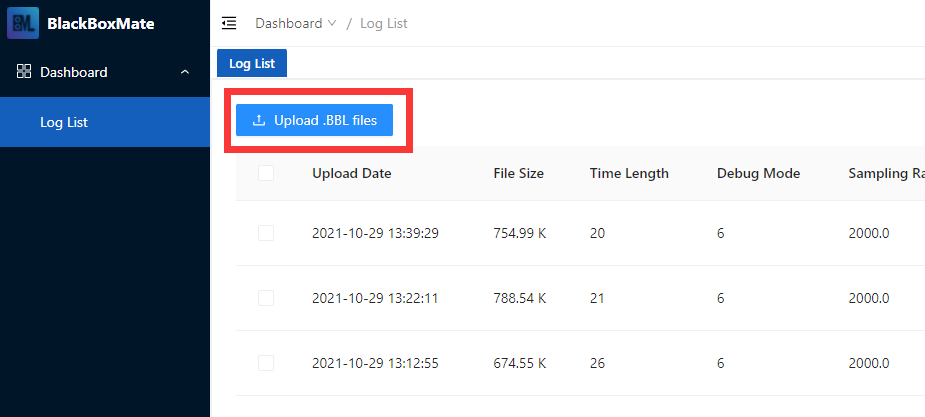
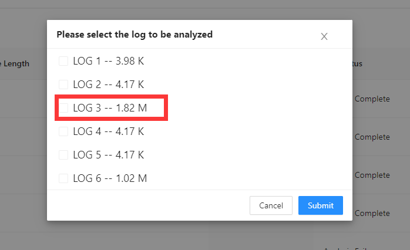
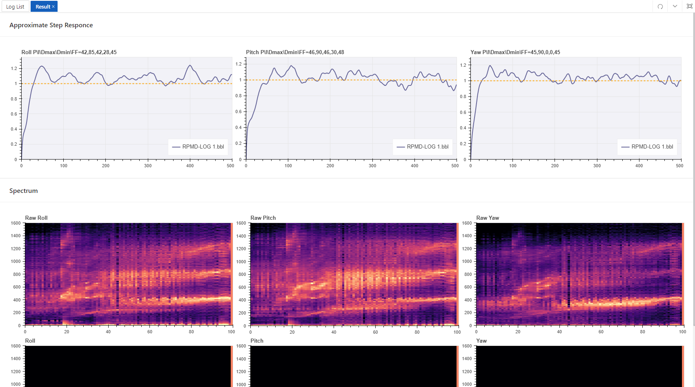
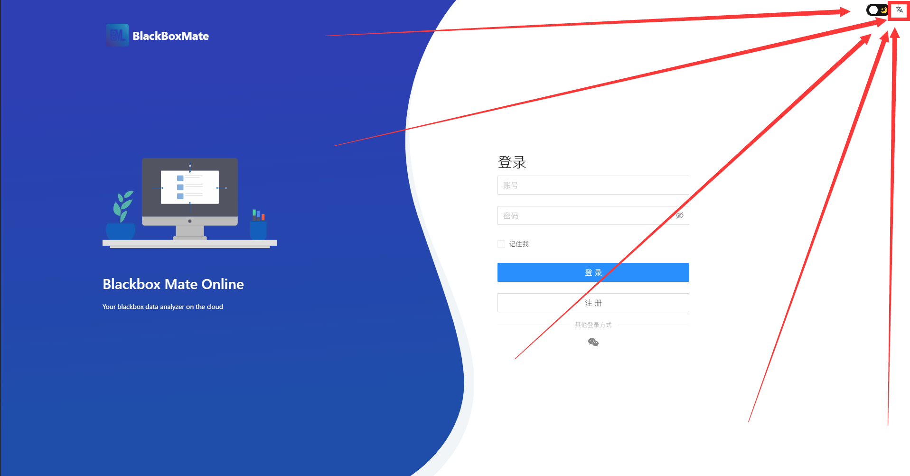

# How to use

### Step 1: Register an Account

Click the "Sign up" button to create an account for your own.


We will not expose your account information to any third party, even ourselves. Since the user database is encrypted, even we cannot easily view your user information.


### Step 2: Sign in BBM

Now sign in with the account that you created in the last step.

### Step 3: Upload your Blackbox logfile

There's a blue button named "Upload .BBL file", click it, then choose the log file you wanna choose.

After that, the web will ask you which sub-log to upload, choose the proper sub-log and hit "Submit".

### Step 4: Check the result

After some seconds, the "Check Analysis Result" button will lighten up. That means the analysis for your log has been done. Click that button and you can see your analysis result there.

### **Change to English**

We have** **made our website automatically change the language to English if you are not in China. But this mechanism still has some bugs and might not work properly as expected. So here we will show you how to switch English version.

There's a little button displayed like "文A" on the top right corner. Click it and you will see the English option there. Select English and the page will flash. Now you are in English.

